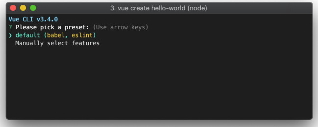
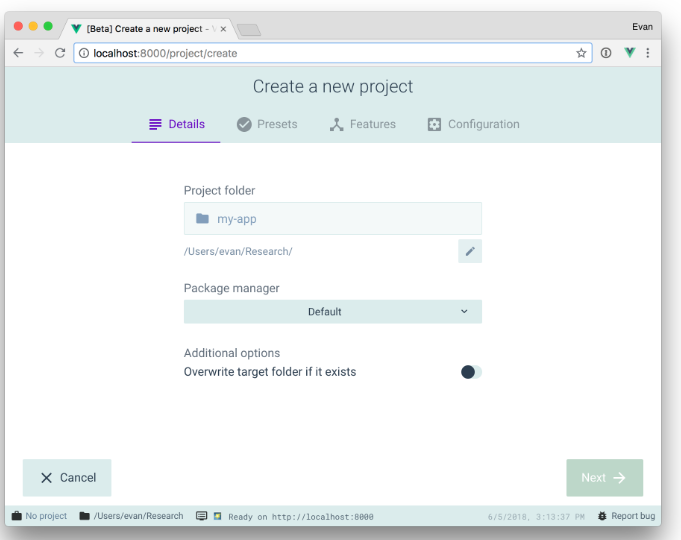

# 使用vue-cli脚手架搭建vue开发环境

## vue-cli是什么？
vue-cli是vue官方提供的专门为单页面应用快速搭建繁杂的脚手架，它可以轻松的创建新的应用程序
而且自动生成vue和webpack的项目模板。最新版本是vue-cli3.0。

## vue-cli3.0全局安装  
打开cmd命令行窗口，输入以下命令   
> npm install -g @vue/cli 或 yarn global add @vue/cli   

如果已安装vue-cli2.0需要先卸载，再安装    
> npm uninstall -g vue-cli     

如果想在vue-cli3.0上使用vue-cli2.0的构建命令`vue init`，可以全局安装一个桥架工具。     
> npm install -g @vue/cli-init    
> # `vue init` 的运行效果将会跟 `vue-cli@2.x` 相同  
> vue init webpack my-project    

## vue-cli 创建一个项目
打开项目所在文件夹，输入以下命令   
> vue create my-project      

此时你会被提示选取一个 preset。你可以选默认的包含了基本的 Babel + ESLint 设置的 preset，也可以选“手动选择特性”来选取需要的特性，如下图：      
   

## vue-cli 可视化创建项目
在命令行输入以下命令可在浏览器打开可视化页面   
> vue ui    

  

## vue-cli 创建的项目文件介绍 
- public 存放html和静态资源  
- src    源代码，是我们主要写代码的地方
- babel.config.js  babel配置文件
- package.json    
- vue.config.js  vue项目配置文件（包括webpack）  

## vue-cli3进行跨域代理配置
```javascript
// vue.config.js
module.exports = {
  // 修改的配置
  // 将baseUrl: '/api',改为baseUrl: '/',
  baseUrl: '/',
  devServer: {
    proxy: {
      '/api': {
        target: 'http://www.example.org',
        changeOrigin: true,
        ws: true,
        pathRewrite: {
          '^/api': ''
        }
      }
    }
  }
}
```

## vue-cli3 配置全局的less变量
1. 在项目下打开命令行，输入以下命令
> vue add style-resources-loader    
2. 此时会让css预处理器(less, sass等), 选择less即可
3. 在vue.config.js进行配置引入已写好的全局less变量
```javascript
pluginOptions: {
  'style-resources-loader': {
    preProcessor: 'less',
    patterns: [
        //这个是加上自己的路径，
        //注意：试过不能使用别名路径
        path.resolve(__dirname, './src/common/less/index.less'),
    ]
  }
}
```
